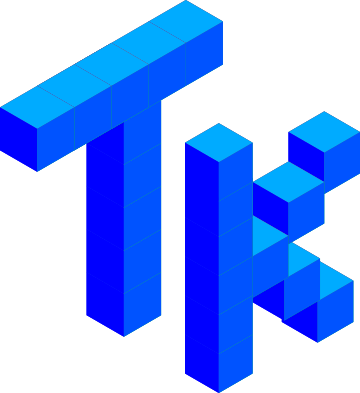

# Awesome Tk 

A curated list of awesome Tk apps and resources for developers.

# Contents

* Applications
  - [Computer-Aided Design](#computer-aided-design)
  - [Games](#games)
  - [Science and Engineering](#science-and-engineering)
  - [Software Development](#software-development)
  - [Utilities](#utilities)
* Resources for Developers
  - [Books](#books)
  - [DSLs](#dsls)
  - [GUI Designers](#gui-designers)
  - [Tutorials](#tutorials)
  - [Widgets](#widgets)
* [Contributing](#contributing)

## Computer-Aided Design

- [BRL-CAD](https://brlcad.org/)

  A powerful open source cross-platform solid modeling system.

- [rattleCAD](www.rattlecad.com/)

  Supports your bicycle design and build process of bespoked bicycle frames with a fully parametric bicycle model.  

## Games

- [Scidb](http://scidb.sourceforge.net/)

  A chess database application for Linux/Unix and Windows.

- [Scid vs. PC](http://scidvspc.sourceforge.net/)

  A powerful Chess Toolkit. Create huge databases, run chess engines, and play casual games against the computer or online with the Free Internet Chess Server.

## Science and Engineering

- [Cassiopée](http://elsa.onera.fr/Cassiopee/)

  A set of Python modules for pre- and post-processing of CFD computations.

- [EMANIM Classic](https://emanimclassic.szialab.org/)

  Visualize electromagnetic waves.

- [GiD](https://www.gidhome.com/)

  A universal, adaptive and user-friendly pre and post processor for numerical simulations in science and engineering.

- [Huygens Localizer | Scientific Volume Imaging](https://svi.nl/Huygens-Localizer)

  A stand-alone software package for fast & high performance processing of Single Molecule Localization Microscopy data.

- [loon](https://great-northern-diver.github.io/loon)

  An extensible interactive data visualization system designed for exploratory visualization.

- [Partek® Genomics Suite®](https://www.partek.com/partek-genomics-suite/)

  A statistical analysis software that lets you analyze microarray, qPCR, and pre-processed NGS data.

- [plotchart](https://wiki.tcl-lang.org/page/plotchart)

  Simple yet versatile plotting and charting.

- [SAOImageDS9](https://sites.google.com/cfa.harvard.edu/saoimageds9/home)

  An image display and visualization tool for astronomical data.

## Software Development

- [IDLEX](idlex.sourceforge.net/)

   A collection of over twenty extensions and plugins that enhance the Python IDE [IDLE](https://docs.python.org/3/library/idle.html).

- [tkdiff](https://sourceforge.net/projects/tkdiff/)

  Side-by-side diff viewer, editor and merge preparer with several innovative features.

## Utilities

- [Expect](https://core.tcl-lang.org/expect)

  A tool for automating interactive applications such as telnet, ftp, passwd, fsck, rlogin, tip, etc.

- [Manpower](https://www.codebykevin.com/manpower.html)

  Search, Browse and Read Man Pages.

- [PortAuthority](https://www.codebykevin.com/portauthority.html)

  Easy to use solution for managing MacPorts software packages.

- [PyIDM](https://github.com/pyIDM/PyIDM)
  
  Open-source alternative to Internet Download Manager with a high-speed engine.

- [QuickWho](https://www.codebykevin.com/quickwho.html)

  Provides a rich array of information (including geographic data) about specific Internet domains.
  
- [Stringscan](https://www.codebykevin.com/stringscan.html)

  Elegant Search for Text in Multiple Directories.

- [TextSweep](https://www.codebykevin.com/textsweep.html)

  Easy Batch Search-and-Replace in Text Files.

- [Windows Inspection Tool Set](https://wits.magicsplat.com/)

  View operating system information, processes, services, users, network interfaces and connections, file shares, printers and more.

## Books

- [Modern Tkinter for Busy Python Developers by Mark Roseman](https://tkdocs.com/book.html)

  Quickly learn to create great looking user interfaces for Windows, Mac and Linux using Python's standard GUI toolkit.

## DSLs

- [Glimmer DSL for Tk](https://github.com/AndyObtiva/glimmer-dsl-tk)

  Ruby-based DSL providing a declarative syntax for writing GUIs in Tk.

## GUI Designers

- [Formation studio](https://github.com/ObaraEmmanuel/Formation)

  GUI designer for Tk. Export the design as XML and load it in your code.

- [Pygubu](https://github.com/alejandroautalan/pygubu-designer)

  GUI designer for Tk. Export the design as XML and load it in your code.

## Tutorials

- [TkDocs | Modern Tk Best Practices](https://tkdocs.com/)

  This tutorial will quickly get you up and running with the latest Tk from Python, Tcl, Ruby, and Perl on macOS, Windows, or Linux.

## Widgets

- [AwesomeTkinter | Pretty Tkinter widgets](https://github.com/Aboghazala/AwesomeTkinter)

  Including radial progress bar, scrollbar without arrows, and many others.

- [Revised Implementation of Tk Text Widget](http://scidb.sourceforge.net/tk/revised-text-widget.html)

  Faster and improved text widget for Tk.

- [Tk-Components](https://www.codebykevin.com/fossil.cgi/tk-components/dir?ci=tip)

  Including TkWebview, TkDock, StatusIcon, QuickLook and many more.

# Contributing

If you have something awesome to contribute to this list, [read](contributing.md) here how to do it.
